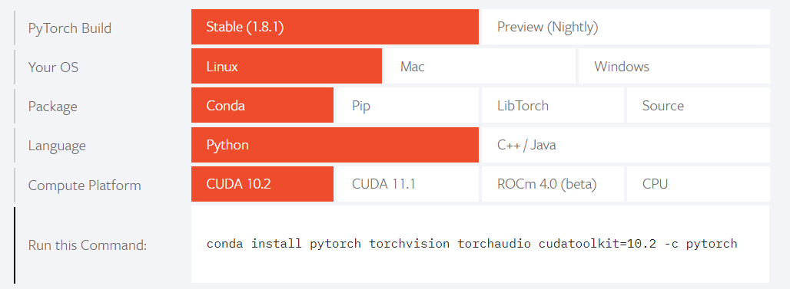

# **用PyTorch搭建卷积神经网络**

本篇文章是一篇基础向的PyTorch教程，适合有一定的机器学习，深度学习和神经网络理论基础，接触过卷积神经网络，缺没有用过PyTorch搭建神经网络的同学。本文会分成以下几个部分：

1. PyTorch基础教程
2. 用Pytorch搭建CNN
3. 优化CNN模型

## 1. **Pytroch 基础**

### 1.1 安装PyTorch
本节内容主要介绍如何用conda安装PyTorch。PyTorch的官网也是推荐了Anaconda作为管理Python包的工具，因为其兼容性可以说是非常优秀了。

**前提要求**：
- Python 3.0 +
- 已安装Anaconda


**步骤**
1. 首先登录Pytorch的官网：https://pytorch.org/

2. 找到 *Install PyTorch* 的部分



3. 安装设置仅供参考：
  - PyTorch Build：选择 *Stable(1.x.1)*
  - Your OS：根据读者的操作系统决定，笔者选用Linux系统作为参考
  - Package：推荐使用Anaconda
  - Language：根据语言环境决定，笔者选用Python。本篇其余内容都会基于Python语言进行说明
  - Computed Platform：PyTorch是支持在GPU上进行计算的：若没有GPU支持，那么选择 *CPU* 即可；若是虚拟机 / 服务器有GPU支持，则选择 *CUDA (10.x)*；若是有英伟达NVidia显卡，可选择 *CUDA (11.x)*；若读者不确定平台支不支持GPU，则依然选择 *CUDA (10.x)*。


4. 最后复制 *Run This Command* 里的指令运行就好了。
```bash
conda install pytorch torchvision torchaudio cudatoolkit=10.2 -c pytorch
```

后续笔者也会介绍如何判断平台当下是在用CPU / GPU进行计算的。

### 1.2 Tensors

现在我们就来开始使用PyTorch。首先介绍的就是Pytorch里最重要的数据结构：Tensors。PyTorch中的所有的模型输入、输出，模型参数都是以Tensor的形式储存的

Tensors其实和NumPy中的`numpy.array`十分相似，但最大区别就在于`tensor`可以在GPU或者其他的硬件加速器上进行计算。此外，`tensor`也是专门为PyTorch其中一个模块 *自动求导（Automatic Differentiation）* 进行了优化。如果此前读者使用过NumPy，那整个Tensors系统也就不难上手了！

```python
import torch
import numpy as np
```

#### 1.2.1 查看计算平台
前文有提到PyTorch是支持在GPU进行计算的，那如何查看GPU是否可用，我们只需要执行以下命令:

```python
device = torch.device("cuda:0" if torch.cuda.is_available() else "cpu")
print(device)
```
Out：
```
cpu
```
说明笔者的虚拟机不支持或没有cuda进行计算。如果输出是`cuda:0`则是可以使用GPU进行计算，后文会教大家如何把一个变量迁移到cuda上。

#### 1.2.2 创建一个Tensor
除了可以从data直接创建Tensor以外，它也可以和`numpy.array`互相转换
```python
data = [[1, 2], [3, 4]]
x_tensor = torch.tensor(data)
```
```python
np_arr = np.array(data)
x_from_np = torch.from_numpy(np_arr) # numpy --> tensor
x_from_tensor = x_data.numpy() # tensor --> numpy
```

同时`tensor`也有许多和`numpy.array`相似的属性：

```python
print(f"Shape of tensor: {x_tensor.shape}")
print(f"Datatype of tensor: {x_tensor.dtype}")
print(f"Device tensor is stored on: {x_tensor.device}")
```
Out:
```
Shape of tensor: torch.Size([2, 2])
Datatype of tensor: torch.int64
Device tensor is stored on: cpu
```

#### 1.2.3 Tensor的运算
相信大家也从上面看得出`numpy.array`和`tensor`在很多指令上是高度相似的，诸如切分，数学运算等。那笔者在这里也不一一介绍Tensor的一些运算指令了，具体可以参考[这个链接](https://pytorch.org/docs/stable/torch.html#tensors)。在这里只会说明上文中提到的Tensor迁移至GPU上的方法，比较重要。

所有Tensor都会默认创建在CPU上，如果想要使用GPU对Tensor进行计算，就必须用`.to()`指令将Tensor迁移到GPU上：
```python
# We move our tensor to the GPU if available
if torch.cuda.is_available():
  x_tensor = x_tensor.to('cuda')
```
或是用之前已经声明的`device`变量，在创建Tensor的时候就完成迁移：
```python
x = torch.tensor(data).to(device)
```

### 1.3 Datasets 和 Dataloaders
说完一些关于Tensor的基础介绍，接下来我们就要来看看PyTorch在处理数据集上有一些怎样的模块。我们做一个深度学习的项目过程中，会通常希望数据集的处理部分和训练部分是分开的。这样我们的代码才能做到高可读性、高修改性。

PyTorch提供了两个十分优秀的数据模块：`torch.utils.data.Dataset`和`torch.utils.data.Dataloader`。它们在PyTorch深度学习流程中扮演的角色如下：我们用`Dataset`自定义数据集，接着传递给`Dataloader`实现数据集的迭代，提供给模型进行训练。

```python
import torch
from torch.utils.data import Dataset, DataLoader
from torchvision import datasets
from torchvision.transforms import ToTensor
import matplotlib.pyplot as plt
```

#### 1.3.1 下载预备数据
PyTorch有着许多预备的数据可以提供给我们进行使用和把玩，从`torchvision.datasets`中可以进行下载。具体在这里就不详细说明了，可以参考[这个链接](https://pytorch.org/tutorials/beginner/basics/data_tutorial.html)的第一部分。

#### 1.3.2 自定义数据集
这里，我会用一个以前做过的项目来一起看一下`Dataset`和`Dataloadeer`的强大之处。

首先介绍一下项目背景：数据源中的每一个数据都是由MNIST Digits改变而成的多数字图片，即一张图片中有至多5个数字。而训练目标就是能够识别一张图片中的数字（至多5个）。我们给出的思路是将训练集的每个数据（即图片）都切割成一张张由单个数字组成的图片，作为新的数据集进行训练（train）；在识别（predict）阶段也是将原图切割后一一识别。

这里将会省略前期预处理的部分。经过预处理，数据集重新变成了由280000张单数字图片。其中，每一张图片都是 1\*28\*28 的`numpy.array`。


那第一步就是将这些数据集用`torch.utils.data.Dataset`导入：任何自定义的数据集都需要继承这个类并覆写相关方法。

```python
class CustomedDataSet(Dataset):
    def __init__(self, train=True, train_x = None, train_y = None, test_x = None, test_y = None, val = False, transform = None):
        self.train = train
        self.val = val
        self.transform = transform
        if self.train:
            self.dataset=train_x
            self.labels=train_y
        elif val:
            self.dataset=test_x
            self.labels=test_y
        else:
            self.dataset= test_x

    def __getitem__(self, index):
        if self.train:
            return torch.Tensor(self.dataset[index].astype(float)).to(device), self.labels[index].to(device)
        elif self.val:
            return torch.Tensor(self.dataset[index].astype(float)).to(device), self.labels[index].to(device)
        else:
            return torch.Tensor(self.dataset[index].astype(float)).to(device)

    def __len__(self):
        return self.dataset.shape[0]
```

笔者因为数据前期已经预处理过了，已经做好了读取数据文件（.h5）的部分，所以整个Class看起来较为简单直接。一个自定义的`Dataset`Class必须实施3个函数：*\_\_init\_\_* ，*\_\_getitem\_\_* 和  *\_\_len\_\_*。我们一一讲解。

* ***\_\_init\_\_(self, )*** ：

  和一般的Class一样，\_\_init\_\_函数在创建`Dataset`的时候会被执行。该函数的输入变量是完全自由的，没有限制。如果需要从外部文件读取数据，也通常会在这一部分进行，以避免在之后的函数里重复读取。我们这里只是将`numpy.array`进行导入。其中，`transform`会在下一章节重点介绍。

* ***\_\_getitem\_\_(self, index)*** ：

  \_\_getitem\_\_函数根据索引`index`，返回数据集中的一个数据。这里，我们将该数据从`numpy.array`变成`tensor`，迁移到`device`上，再进行输出。除了最基本的提取数据之外，我们也可以根据需求，在这个函数中对数据进行一些改动。一开始如果初始化了`transform`也会在这里用到。

* ***\_\_len\_\_(self)*** ：

  该函数返回数据集中数据的总量。

不难看出，`Dataset`给予了使用者十分高的自由度：如何读取数据集，如何简单地处理、变化数据集（运算，切分，reshape，正则.....）都可以在这个Class里做到，不用额外写很多零零散散的Block。易于使用和统一管理。

```python
train_set = CustomedDataSet(train_x = new_train_x, train_y = new_train_y)
val_set = CustomedDataSet(test_x = new_val_x, test_y = new_val_y, train=False, val = True)
```

#### 1.3.3 DataLoader

Dataset负责建立索引到样本的映射，而DataLoader负责以特定的方式从数据集中迭代的产生 一个个batch的样本集合。

```python
DataLoader(dataset, batch_size=1, shuffle=False, sampler=None,
           batch_sampler=None, num_workers=0, collate_fn=None,
           pin_memory=False, drop_last=False, timeout=0,
           worker_init_fn=None)
```
其中我们关注几个比较重要的参数，其余的在[这个链接中](https://pytorch.org/docs/stable/data.html)详细介绍了。

* `dataset`：定义好的`Dataset` Class作为数据集。

* `batch_size`（可选）：一个batch含有多少样本，Default = 1。

* `shuffle`（可选）：每一个epoch的batch样本是否随机，Default = False。

* `Sampler`（可选）：Sampler Class可以自定义数据集中采样的方法，如果有，则必须`shuffle=False`

`Sampler`作为自定义采样器，和`Dataset`一样可编辑性都非常高。这篇文章就不做详细介绍了，可以参考[这篇博客](https://chenllliang.github.io/2020/02/04/dataloader/#%E9%87%87%E6%A0%B7%E5%99%A8)。

```Python
train_loader = DataLoader(dataset=train_set,
                          batch_size=60],
                          shuffle=True)
val_loader = DataLoader(dataset=val_set,
                        batch_size=5,
                        shuffle=False)
```

这里的batch_size其实是CNN的hyperparameter之一，是需要优化的。和机器学习的模型一样，深度学习的模型也是需要通过Cross Validation来优化模型的，且调参过程也十分雷同，这一部分不在这篇文章中再详细介绍了。`val_set`和`val_loader`就是CV里的validation set，不需要shuffle。

在创建了`DataLoader`后，调用起来十分简便，在需要迭代数据集的时候调用Python内置函数`enumerate`或者`iter`即可。

```Python
for batch_idx, (data, target) in enumerate(train_loader):
  ...
  ...

```

在`enumerate`过程中实际上是dataloader按照其参数`sampler`规定的策略调用了其dataset的`__getitem__`方法。这里需要注意的是，`enumerate`输出的第一项`batch_idx`不是单个数据的索引，而是整个batch的索引，务必不要用这个索引去定位单个数据集。

### 1.4 Transforms
上文提到，我们可以通过`torchvision.transform`对我们的数据集做出一些变化（正则、切片、reshape...），让其能够符合训练模型输入的格式，或是进一步提高模型训练的质量。我们就来简单看两个transform的例子，想要具体了解的读者可以参考[官网给出的说明](https://pytorch.org/vision/stable/transforms.html)，或是这篇[中文解读](https://www.jianshu.com/p/1ae863c1e66d)。

#### 1.4.1  ToTensor()
`ToTensor()`可以将PIL图像或`numpy.array`转换成`FloatTensor`，并在[0, 1]的范围里缩放图像的像素强度值。

#### 1.4.2  Lamda转换
Lambda转换可以使用任何定义的lamda函数。这边我们举一个用lambder函数完成对10种分类标签one-hot encoding的例子。

```python
target_transform = Lambda(lambda y: torch.zeros(
    10, dtype=torch.float).scatter_(dim=0, index=torch.tensor(y), value=1))
```

transform既可以在下载预备数据集的时候作为调用参数，也作为自定义数据集的`__init__`输入。我们接下来看一个下载预备数据的实例。

```python
from torchvision import datasets
from torchvision.transforms import ToTensor, Lambda

ds = datasets.FashionMNIST(
    root="data",
    train=True,
    download=True,
    transform=ToTensor(),
    target_transform=Lambda(lambda y: torch.zeros(10, dtype=torch.float).scatter_(0, torch.tensor(y), value=1))
)
```

这里`transorm`仅针对feature进行转换，而`target_transform`是针对label的转换。


## 2. **搭建和训练CNN神经网络**
准备好我们数据集之后，我们可以开始着手搭建卷积神经网络（CNN）了。我们先来看一个CNN的例子，再逐步进行讲解。

```python
import torchvision
import matplotlib.pyplot as plt
from torch import nn, optim
import torch.nn.functional as F
```

```python
class CNN(nn.Module):
    def __init__(self):
        super(Net, self).__init__()

        self.conv1 = nn.Conv2d(1,10,5)
        self.conv2 = nn.Conv2d(10,20,3)

        self.fc1 = nn.Linear(20*10*10,500)
        self.fc2 = nn.Linear(500, 11)

    def forward(self, x):     
        input_size = x.size(0)
        # in: batch*1*28*28, out: batch*10*24*24(28-5+1)
        x = self.conv1(x)
        # out: batch*24*24
        x = F.relu(x)
        # in: batch*24*24, out: batch*10*12*
        x = F.max_pool2d(x,2,2)

        # in: batch*10*12*12, out: batch*120*10*10 (12-3+1)
        x = self.conv2(x)
        x = F.relu(x)

        # 20*10*10 = 2000
        x = x.view(input_size,-1)

        # in: batch*2000 out:batch*500
        x = self.fc1(x)
        x = F.relu(x)

        # in:batch*500 out:batch*10
        x = self.fc2(x)
        return F.log_softmax(x)

```

我们首先通过继承`nn.Module`定义我们的CNN Class，然后在`__init__`里创建CNN的每个layer。神经网络所有运算通过`forward`函数实现。这个CNN例子中一共是两个2维卷积层和两个全连接线性层，通过一些激活函数（activation function）做连接，最后输出softmax分类结果。

这里笔者是把所有神经网络层放在`___init___`中，所有的激活函数都放在了`forward`里。当然也可以通过`nn.Sequential()`将这些激活函数和神经网络层一并按顺序放在`__init__`里。

### 2.1 卷积层（2d）
因为是一篇CNN的文章，我们就来着重讲一下卷积层。刚才的实例是前文笔者谈到的个人项目中所用到的CNN。因为要识别的是二维的图片，用到了二维的卷积层`torch.nn.Conv2d`。这里就重点介绍一下这个Class。

```Python
torch.nn.Conv2d(in_channels, out_channels, kernel_size,
                stride=1, padding=0, dilation=1, groups=1,
                bias=True, padding_mode='zeros')
```

我们来看看重点参数：
* `in_channels` (int)：输入图像通道数

* `out_channels` (int)：卷积产生的通道数

* `kernel_size` (int or tuple)：卷积核尺寸

* `stride` (int, optional)：卷积步长，默认为 1

我们来看一个运算例子：

```Python
input = torch.randn(1,1,28,28)
conv1 = nn.Conv2d(1,10,5)
output = conv1(input)

print(input.shape)
print(output.shape)
```
Out:
```Python
torch.Size([1, 1, 28, 28])
torch.Size([1, 10, 24, 24])
```
输入图像是（1\*1\*28\*28）：第一个1是batch size，这里可以忽略，这是一张单通道，28\*28的图像。卷积层的输入也是单通道，需要和图像的通道数量保持一致！输出是10个通道，卷积核的尺寸是5\*5。所以我们的输出也自然是 （1\*10\*24\*24）：其中batch size = 1 保持不变，图像变成了(24\*24)，24 = 28 - 5 + 1 。

了解了卷积层的运作模式，我们来，了解最基本的用法：在创建了一个`Net`class之后，我们直接输入`input`，就可以通过`forward`函数得到结果。当然这个例子只是简单做个展示，模型还未被训练过，所以每次的输出都不精确。

```Python
network = Net()
output = model(input)
pred = output.argmax(1)
print(pred)
```
Out:
```Python
tensor([9])
```

### 2.2 训练CNN
目前为止，我们导入预处理好的数据，创建了能够迭代数据的Dataloader，搭建好了我们的卷积神经网络，我们离能训练CNN还差最后两个组件：**损失函数**（loss function）和**优化器**（optimizer）。

首先我们先定义这个模型的hyperparameter，这篇文章不做Cross Validation调参的介绍和应用。：
```Python
learning_rate = 1e-3
batch_size = 60
epochs = 5
```

#### 2.2.1 损失函数
我们都知道损失函数是计算预估值和实际值时间的损失量，也是在训练过程中想要优化的对象。通常所用的损函数有：回归任务用到的`nn.MSELoss`（均方误差）以及分类任务用到的`nn.NLLLoss`（负对数似然）。而`nn.CrossEntropyLoss`前两者的结合，对一直以来熟悉机器学习的读者应该也不会陌生。这里我们因为是分类任务，所以选择负对数似然。

```Python
loss = F.nll_loss(output, target)
```

#### 2.2.2 优化器
大家对优化算法应该也不陌生，最常见的优化算法就是梯度下降（Gradient Descent）。我们这里采用的是随机梯度下降（Stochastic Gradient Descent）。

```python
optimizer = torch.optim.SGD(model.parameters(), lr=learning_rate)
```
在一个训练循环中，优化有3个步骤：

1. 执行`optimizer.zero_grad`来清空系统中积累的梯度，

2. 通过调用`loss.backward()`反向传播预测损失。PyTorch会储存每一个参数对应的损失梯度。

3. 当得到损失梯度以后，调用`optimizer.step()`来实现优化和调整参数。

#### 2.2.3 完整实现
训练：

```python
def train(network, train_loader, optimizer):
    network.train()
    for batch_idx, (data, target) in enumerate(train_loader):
        optimizer.zero_grad()

        output = network(data)
        loss = F.nll_loss(output, target)
        loss.backward()

        optimizer.step()
```

这里要重点提一句：`network.train()`的作用是启动 Batch Normalization 和 Dropout。在训练一个模型时，这个指令可以完全改变训练的结果，请根据业务需求来选择是否使用。

* **Batch Normalization**

  其作用对网络中间的每层进行归一化处理，并且使用变换重构（Batch Normalization Transform）保证每层提取的特征分布不会被破坏。训练时是针对每个mini-batch的，但是测试是针对单张图片的，即不存在batch的概念。由于网络训练完成后参数是固定的，每个batch的均值和方差是不变的，因此直接结算所有batch的均值和方差。

  Batch Normalization有非常多的好处，其中最直接的还是**训练提速**：该算法背后的理论可以支持我们选择比较大的初始学习率。我们也知道当学习率变大时，随机梯度下降算法收敛得也就越快。这样我们可以不用繁琐地调整学习率，大大提高了优化模型的效率。

  想要进一步了解 BatchNormalization 的同学可以移步[这篇博客](https://blog.csdn.net/hjimce/article/details/50866313)。有英语基础的同学也可以直接阅读这个算法的源文献：《Batch Normalization: Accelerating Deep Network Training by Reducing Internal Covariate Shift》。

* **Dropout**

  其作用克服Overfitting，在每个训练批次中，通过忽略一半的特征检测器，可以明显的减少**过拟合**现象。


准确度：
```Python
def accuracy(epoch_idx, test_loader, network, set_type = None):   
    correct = 0
    with torch.no_grad():
        for data, target in test_loader:
            outputs = network(data)
            _, predicted = torch.max(outputs.data, 1)
            correct += (predicted == target).sum().item()

    if set_type == "train":
        print('\nEpoch{}: Train accuracy: {}/{} ({:.0f}%)\n'.format(
            epoch_idx, correct, len(test_loader.dataset),
            100. * correct / len(test_loader.dataset)))

    if set_type == "val":
        print('\nEpoch{}: Test accuracy: {}/{} ({:.0f}%)\n'.format(
            epoch_idx, correct, len(test_loader.dataset),
            100. * correct / len(test_loader.dataset)))

    return correct / len(test_loader.dataset)

```

```Python
train_set = CustomedDataSet(train_x = new_train_x, train_y = new_train_y)
val_set = CustomedDataSet(test_x = new_val_x, test_y = new_val_y, train=False, val = True)

train_loader = DataLoader(dataset=train_set,batch_size=104,shuffle=True,)
val_loader = DataLoader(dataset=val_set,batch_size=batch_size_test,shuffle=False)

network = Net().to(device)
optimizer = optim.SGD(network.parameters(), lr=learning_rate,momentum=momentum)

for i in range(1,n_epochs+1):
  print(f"Epoch {t+1}\n-------------------------------")
  train(epoch_idx = i, train_loader = train_loader, optimizer = optimizer, network = network)
  train_accuracy = accuracy(epoch_idx=i, test_loader = train_loader, network = network, set_type = "train")
  val_accuracy = accuracy(epoch_idx=i, test_loader = val_loader, network = network, set_type = "val")

```

### 2.3 保存和导入
Pytorch支持把训练好的神经网络用以下两种不同的方式保存到到本地路径；相对的，导入方式也不太一样：

* **保存整个神经网络**
```Python
torch.save(network, PATH) # PATH variable should be stated
trained_net = torch.load(PATH) # PATH same as above
```

* **保存网络中的参数**

  这样做的好处是速度快，占用的空间少。但是导入网络参数时，要先创建一个网络变量：
```python
torch.save(network.state_dict(), PATH) #保存参数
```
```Python
trained_net = Net().to(device) #先创建一个网络变量
trained_net.load_state_dict(torch.load('model_weights.pth')) # 再导入参数
trained_net.eval()
```
  这里也是要提一嘴 `Network.eval()` 的作用：

  不启用 Batch Normalization（BN） 和 Dropout，保证BN和dropout不发生变化，pytorch框架会自动把BN和Dropout固定住，不会取平均，而是用训练好的值，不然的话，一旦test的batch_size过小，很容易就会被BN层影响结果。

## 3. 优化CNN模型
大家都知道任何机器学习和深度学习的模型都需要通过 Cross Validation 反复训练找到预测精准度最高的 hyperparameter 组合。像是 Grid Search 和 Random Search 相信大家也都不陌生了，不在这篇文章里做详细的介绍和实现了。这里给大家介绍CNN模型中的hyperparameter。

### 3.1 CNN结构
对于任何类型的神经网络来说，网络的结构（Architecture）都是影响预测精准性的第一因素。举个例子，对于图像识别来说，CNN肯定比一般的全连接线性网络有效，因为卷积层的性质就是用来解析图像的。那要用多少层卷积层？多少层线性层？卷积层的滤波和通道数分别是什么？

这些复杂的结构型问题显然不能通过 Cross Validation 来做出决策和判断。一个优秀的神经网络结构的背后是庞大的理论和科研支持。因此，笔者不建议大家花费大量的精力对一个CNN的结构进行优化，而是以需求为出发点去寻找目前为止被广泛认可的神经网络模型。

* **VGG** - 图像识别（定位任务）

  VGG的论文[《Very Deep Convolutional Networks for Large-Scale Visual Recognition》](https://www.robots.ox.ac.uk/~vgg/research/very_deep/)探讨了CNN的深度对于图片识别精准度的影响。论文中对比了了从11到19层不同的CNN模型，其中16层的CNN（**VGG16**）被广泛使用，也同时被收录在PyTorch里可以直接调用。

* **GoogLeNet** - 图像识别（分类任务）

  如果你觉得VGG的19层已经很深了的话，那你就错了！[Google](https://arxiv.org/pdf/1409.4842.pdf)研发的GoogLeNet深度已经达到了22层！但是，GoogLeNet属于稀疏CNN，其大小比VGG16小很多：GoogleNet参数为500万个（5M），VGG16参数是138M。其思想是：在神经网络结构中，去除“无效的”的激活函数，并使用很多Inception模块，利用不同大小的卷积核实现不同尺度的感知。

### 3.2 其他的Hyperparameter
除了结构之外，其他的Hyperparameters就需要我们自己用Grid Search, Random Search去优化了。那这些hyperparametes包括:

* **Epochs**数：即迭代次数

* **Learnin Rate**（学习率）：即优化器的学习率。

* **优化器**：学习率是跟着优化器走的。上文中用的是随机梯度下降（SGD），除了学习率以外还可以调整 **动量（momentem）**和 **批样本（mini batch size）**；在ADAM优化器里用到的是自适应性的学习率，就有其他的hyperparameters出现了。


## 结语
这还是一篇基础向的文章，希望能够帮到刚刚接触PyTorch的人。


## References
1. [PyTorch 官网教程](https://pytorch.org/tutorials/beginner/basics/intro.html)

2. [Liang's Blog](https://chenllliang.github.io/2020/02/04/dataloader/)

3. 《Batch Normalization: Accelerating Deep Network Training by Reducing Internal Covariate Shift》

4. [《Very Deep Convolutional Networks for Large-Scale Visual Recognition》](https://www.robots.ox.ac.uk/~vgg/research/very_deep/)

5. [GoogLeNet](https://arxiv.org/pdf/1409.4842.pdf)
